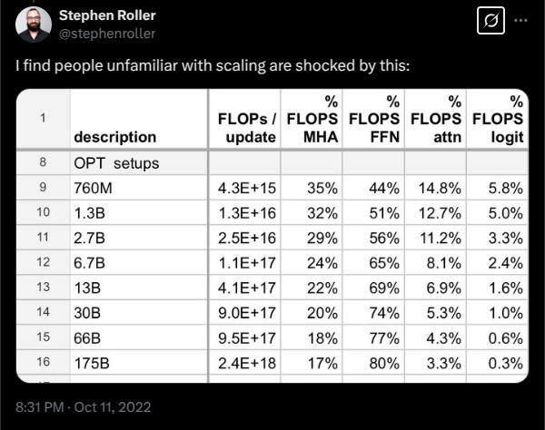
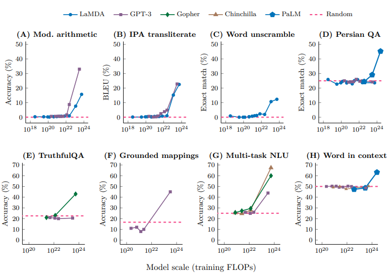

## 课程简介

### 前言
语言模型是现代自然语言处理（NLP）应用的基石，它开创了一种新范式，即通过单一的通用系统来处理一系列下游任务。随着人工智能（AI）、机器学习（ML）和自然语言处理领域的不断发展，深入理解语言模型对于科学家和工程师而言都变得至关重要。本课程旨在让学生全面理解语言模型，引导他们完成自主开发语言模型的全过程。借鉴操作系统课程中从零构建完整操作系统的思路，我们将带领学生了解语言模型创建的各个方面，包括预训练的数据收集与清洗、Transformer模型构建、模型训练以及部署前的评估。

所有在线信息：https://stanford-cs336.github.io/spring2025/ 
这是一门5学分的课程。==*2024年春季课程评价中的评论：整个作业的工作量大约相当于CS 224n的所有5项作业加上期末项目的总和。而这还仅仅是第一个家庭作业。*==
### 你为什么应该选这门课
- 你有强烈的欲望想了解事物的工作原理。
- 你想锻炼自己的研究工程能力。
### 你为什么不应该选这门课
- 你实际上想在这个季度完成研究工作。（去和你的导师谈谈。）
- 你有兴趣了解人工智能领域最热门的新技术（例如，多模态、RAG等）。（你应该为此选一门研讨会课程。）
- 你想在自己的应用领域取得好成果。（你应该直接提示或微调现有的模型。）
### 如何在家跟进学习
- 所有的 lecture 材料和作业都会发布在网上，所以你可以自行跟进学习。
- lecture 会通过CGOE（前身为SCPD）录制，并会在YouTube上发布（会有一定延迟）。
- 我们计划明年再次开设这门课。
### 作业
- 5项作业（基础、系统、缩放定律、数据、对齐）.
- 没有框架代码，但我们会提供单元测试和适配器接口来帮助你检查正确性。
- 先在本地实现以测试正确性，然后在集群上运行以进行基准测试（准确性和速度)。
- 部分作业设有排行榜（在给定的训练预算下最小化困惑度）。
- 人工智能工具（如CoPilot、Cursor）可能会影响学习效果，所以使用时请自行承担风险。

<!-- ## 目录 -->
<!-- Hugo 会自动生成侧边栏，这里也可以手写一些索引 -->

## 这门课程为何存在？
### 为什么我们需要这门课？

我们不妨来问问 [GPT-4 ](https://arxiv.org/pdf/2303.08774)

```
response = query_gpt4o(prompt="why teach a course on buliding language models from scratch? Answer in one sentence.")

print(responese)
```

>Teaching a course on building language models from scratch provides foundational understanding of natural language processing techniques, fosters innovation, and enables effective adaptation of models to specific tasks and domains.

目前存在的很明显的问题：AI 领域的研究者们逐渐和底层的关键技术断联。
 - 8 年前，研究者会亲自实现并训练他们自己的模型。
- 6 年前，研究者们会下载一个模型 (e.g., BERT), 并且亲自 fine-tune它。
- 现在，研究者们可能只会去提示一个强大的专有模型（往往 close-source，e.g., GPT/Claude/ Gemini/-series）。

从汇编语言到面向对象编程，从众多的小模型到一个专有的大模型，完成一个具体任务的抽象程度在逐渐变高，这确实极大的提升了生产力，但是代价是：
- 相较于编程语言或者操作系统，这些抽象是有漏洞的，不稳定的。
- 仍然有一些基础工作需要研究，而这些研究会推翻现有的技术栈。

要完成基础研究，就必须充分的理解这项技术。所以这门课的出发点是通过搭建来完成理解，除此之外还有一些小问题……

### 语言模型的工业化

- [GPT-4据称有1.8万亿个参数。](https://www.hpcwire.com/2024/03/19/the-generative-ai-future-is-now-nvidias-huang-says)
- [GPT-4的训练成本据称达到1亿美元。](https://www.wired.com/story/openai-ceo-sam-altman-the-age-of-giant-ai-models-is-already-over/)
- [xAI构建了一个包含20万个H100芯片的集群来训练Grok。](https://www.tomshardware.com/pc-components/gpus/elon-musk-is-doubling-the-worlds-largest-ai-gpu-cluster-expanding-colossus-gpu-cluster-to-200-000-soon-has-floated-300-000-in-the-past)
- [星门（OpenAI、英伟达、甲骨文）在4年内投资5000亿美元。](https://openai.com/index/announcing-the-stargate-project/)
- 此外，关于前沿模型是如何构建的，没有公开的细节。
- 出自[GPT-4的技术报告](https://arxiv.org/pdf/2303.08774.pdf)的 Section 2 ==Scope and Limitations of this Technical Report:==
> This report focuses on the capabilities, limitations, and safety properties of GPT-4. GPT-4 is aTransformer-style model [39] pre-trained to predict the next token in a document, using both publicly available data (such as internet data) and data licensed from third-party providers. The model was then fine-tuned using Reinforcement Learning from Human Feedback (RLHF) [40]. ==Given both the competitive landscape and the safety implications of large-scale models like GPT-4, this report contains no further details about the architecture (including model size), hardware, training compute dataset construction, training method, or similar.==
 We are committed to independent auditing of our technologies, and shared some initial steps and ideas in this area in the system card accompanying this release. We plan to make further technical details available to additional third parties who can advise us on how to weigh the competitive and safety considerations above against the scientific value of further transparency.

### 大就是强 （More is different）
前沿模型对我们来说确实有些遥不可及，但是构建一个 1B参数以内的小语言模型往往不能够代表的大模型的经验认知。

[示例1](https://x.com/stephenroller/status/1579993017234382849)：用于注意力机制与多层感知机（MLP）的浮点运算（FLOPs）占比会随规模变化。



示例 2: 随着模型 scaling 产生的[涌现行为](https://arxiv.org/pdf/2206.07682)趋势


### 我们可以从这门课上学习到什么可以迁移到前沿模型上的知识？
知识有三种类型：
- 机制：事物如何运作（Transformer是什么，模型并行如何利用GPU）
- 思维模式：充分发挥硬件性能，认真对待规模（缩放定律）
- 直觉：哪些数据和建模决策能产生良好的准确性

我们可以教授机制和思维模式（这些是可以迁移的）。
我们只能部分教授直觉（不一定能跨规模迁移）。

### 直觉？🤷
一些设计决策根本（尚未）没有合理依据，只是源于实验。
例子：诺姆·沙泽尔（Noam Shazeer）介绍 [SwiGLU](https://arxiv.org/pdf/2002.05202.pdf) 的论文。
> We have extended the GLU family of layers and proposed their use in Transformer. In a transfer-learning setup, the new variants seem to produce better perplexities for the de-noising objective used in pre-training as well as better results on many downstream language-understanding tasks. These architectures are simple to implement, and have no apparent computational drawbacks. ==We offer no explanation as to why these architectures seem to work: we attribute their success. as all else. to divine benevolence.==


### 苦涩的教训 (The bitter lesson)
错误解读：规模是唯一重要的，算法并不重要。
正确解读：具有可扩展性的算法才是重要的。

==准确率=效率×资源==

实际上，在更大规模下，效率要重要得多（不能浪费）。
[文章](https://arxiv.org/abs/2005.04305) 表明，2012年至2019年间，在ImageNet上的算法效率提升了44倍。
问题框架：在给定一定的计算和数据预算的情况下，人们能构建出的最佳模型是什么？
换句话说，就是要最大化效率！

## 当前格局
### 神经网络出现前（21世纪10年代前）
- 用于测量英语熵的语言模型 [香农 1950](https://www.princeton.edu/~wbialek/rome/refs/shannon_51.pdf)
- 关于n元语法语言模型的大量研究（用于机器翻译、语音识别） [Brants+ 2007](https://aclanthology.org/D07-1090.pdf)

### 神经组件（21世纪10年代）
- 首个神经语言模型 [Bengio 2003](https://www.jmlr.org/papers/volume3/bengio03a/bengio03a.pdf)
- 序列到序列建模（用于机器翻译） [Sutskever 2014](https://arxiv.org/pdf/1409.3215.pdf)
- Adam优化器 [Kingma 2014](https://arxiv.org/pdf/1412.6980.pdf)
- 注意力机制（用于机器翻译） [Bahdanau 2014](https://arxiv.org/pdf/1409.0473.pdf)
- Transformer架构（用于机器翻译） [Vaswani 2017](https://arxiv.org/pdf/1706.03762.pdf)
- 专家混合模型 [Shazeer 2017](https://arxiv.org/pdf/1701.06538.pdf)
- 模型并行化 [Huang 2018](https://arxiv.org/pdf/1811.06965.pdf),[Rajbhandari 2019](https://arxiv.org/abs/1910.02054),[Shoeybi 2019](https://arxiv.org/pdf/1909.08053.pdf)

### 早期基础模型（21世纪10年代末）
- ELMo：基于LSTM的预训练，微调对任务有帮助 [Peters 2018](https://arxiv.org/abs/1802.05365)
- BERT：基于Transformer的预训练，微调对任务有帮助 [Devlin 2018](https://arxiv.org/abs/1810.04805)
- 谷歌的T5（110亿参数）：将所有内容转化为文本到文本的形式 [Raffel 2019](https://arxiv.org/pdf/1910.10683.pdf)

### 迈向规模化，更封闭
- OpenAI的GPT-2（15亿参数）：文本流畅，首次出现零样本迹象，分阶段发布 [Radford 2019](https://cdn.openai.com/better-language-models/language_models_are_unsupervised_multitask_learners.pdf)
- 缩放定律：为规模化提供希望和可预测性 [Kaplan 2020](https://arxiv.org/pdf/2001.08361.pdf)
- OpenAI的GPT-3（1750亿参数）：上下文学习，封闭模型 [Brown 2020](https://arxiv.org/pdf/2005.14165.pdf)
- 谷歌的PaLM（5400亿参数）：规模庞大，训练不足 [Chowdhery 2022](https://arxiv.org/pdf/2204.02311.pdf)
- DeepMind的Chinchilla（700亿参数）：计算最优缩放定律 [Hoffmann 2022](https://arxiv.org/pdf/2203.15556.pdf)

### 开源模型
- EleutherAI的开源数据集（The Pile）和模型（GPT-J） [Gao 2020][Wang 2021](https://arxiv.org/pdf/2101.00027.pdf),[wang+ 2021](https://arankomatsuzaki.wordpress.com/2021/06/04/gpt-j/)
- 元宇宙的OPT（1750亿参数）：GPT-3的复现，存在诸多硬件问题 [Zhang 2022](https://arxiv.org/pdf/2205.01068.pdf)
- Hugging Face / BigScience的BLOOM：专注于数据来源 [Workshop 2022](https://arxiv.org/abs/2211.05100)
- 元宇宙的Llama模型 [Touvron 2023](https://arxiv.org/pdf/2302.13971.pdf),[Touvron 2023](https://arxiv.org/pdf/2307.09288.pdf)[Grattafiori 2024](https://arxiv.org/abs/2407.21783)
- 阿里巴巴的通义千问（Qwen）模型 [Qwen 2024](https://arxiv.org/abs/2412.15115)
- 深度求索（DeepSeek）的模型 [DeepSeek-AI 2024](https://arxiv.org/pdf/2401.02954.pdf), [DeepSeek-AI 2024](https://arxiv.org/abs/2405.04434),[DeepSeek-AI 2024](https://arxiv.org/pdf/2412.19437.pdf)
- AI2的OLMo 2 [Groeneveld 2024](https://arxiv.org/pdf/2402.00838.pdf),[OLMo 2024](https://arxiv.org/abs/2501.00656)

### 开放程度
- 封闭模型（例如，GPT-4o）：仅提供API访问 [OpenAI 2023](https://arxiv.org/pdf/2303.08774.pdf)
- 开源权重模型（例如，深度求索模型）：提供权重，包含架构细节的论文，部分训练细节，无数据细节 [DeepSeek-AI 2024](https://arxiv.org/pdf/2412.19437.pdf)
- 开源模型（例如，OLMo）：提供权重和数据，包含大部分细节的论文（但不一定包含原理、失败的实验） [Groeneveld 2024](https://arxiv.org/pdf/2402.00838.pdf)

### 当今的前沿模型
- [OpenAI的o3](https://openai.com/index/openai-o3-mini/) 
- Anthropic的[Claude Sonnet 3.7](https://www.anthropic.com/news/claude-3-7-sonnet) 
- xAI的[Grok3](https://x.ai/news/grok-3)
- [Google' s Gemini 2.5](https://blog.google/technology/google-deepmind/gemini-model-thinking-updates-march-2025/)
- [Meta's Llama3.3](https://ai.meta.com/blog/meta-llama-3/) 
- [DeepSeek's R1](https://arxiv.org/pdf/2501.12948.pdf)
- [Alibaba's Qwen 2.5 Max](https://qwenlm.github.io/blog/qwen2.5-max/)
- [Tencent's Hunyuan-T1](https://tencent.github.io/llm.hunyuan.T1/README_EN.html)
- [Meituan's LongCat](https://github.com/meituan-longcat)

